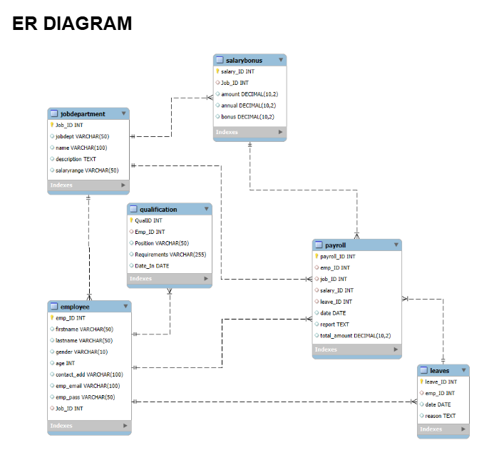

# **Employee Management System - SQL Data Analysis**

A SQL-based data analysis project that examines employee, payroll, and departmental data to generate HR and workforce insights.

## **Project Overview**

- This project demonstrates how SQL can be used to analyze employee management data and generate meaningful insights from organizational datasets.
- The system stores and manages employee information such as job roles, departments, salaries, bonuses, payroll records, qualifications, and leave details using a relational database.
- Through SQL queries, the project helps analyze workforce structure, salary distribution, and payroll expenses to support data-driven HR decision making.
  
## **Problem Statement**

**Many organizations manage employee records manually or across multiple disconnected systems. This creates several problems :**
- Difficulty managing employee information in one centralized system.
- Errors in salary, bonus, and payroll calculations.
- Lack of structured tracking for employee qualifications and leave records.
- Limited ability to generate analytical reports for management decisions.
  
This project solves these issues by creating a structured SQL database system for managing employee data. 

## **Project Objectives**

**The main objectives of this project are :**
- Store and manage employee data efficiently in a relational database.
- Analyze employee hierarchy and departmental structures.
- Perform SQL-based data analysis using joins, aggregations, and filtering.
- Generate business insights related to salaries, payroll, and workforce distribution.
- Analyze workforce distribution and salary structures across departments.
- Support better HR and payroll decision-making through data insights.

## **Tools & Technologies Used**

- **SQL** – Used for querying and analyzing the data. 
- **MySQL** – Used as the relational database management system where the data is stored.  
- **MySQL Workbench** – Used for database design, query execution, and management.

## **Database Tables**

**The Employee Management System database contains the following tables :**
- **Employee** – Stores employee personal details and job assignments. 
- **JobDepartment** – Contains job roles and department information.  
- **SalaryBonus** – Stores salary and bonus details for each job role.
- **Qualification** – Stores employee educational qualifications and position requirements. 
- **Leaves** – Stores employee leave records.  
- **Payroll** – Stores payroll processing information including salary payments and deductions.

## **Database ER Diagram**

The ER diagram explaining the database relationships between the Employee, JobDepartment, SalaryBonus, Qualification, Leaves, and Payroll tables is available in the project presentation.

## **SQL Concepts Used**

**This project demonstrates the use of several SQL concepts including :**
- **`SELECT statements`** – Used to retrieve required data from the database tables.
- **`WHERE filtering`** – Used to filter records based on specific conditions.
- **`JOIN operations`** – Used to combine data from multiple related tables for analysis.
- **`GROUP BY and HAVING clauses`** – Used to group data and apply conditions on aggregated results.
- **`Aggregate functions (SUM, COUNT, AVG)`** – Used to calculate totals, counts, and average values from the data.
- **`ORDER BY for sorting results`** – Used to arrange query results in ascending or descending order.
- **`LIMIT for restricting output rows`** – Used to limit the number of rows returned by a query.
- **`Primary and foreign key relationships`** – Used to maintain data integrity and establish relationships between tables.

## **Key Analysis Questions**

**The project answers several HR and payroll related questions such as :**

**`Employee Analysis :`**
- Total number of employees in the organization.
- Departments with the highest number of employees.
- Average salary per department.
- Identification of the top five highest paid employees.

**`Department and Job Role Analysis :`**
- Number of job roles in each department.
- Salary distribution across departments.
- Departments with the highest total salary allocation.

**`Qualification Analysis :`**
- Employees with recorded qualifications.
- Qualification distribution across job roles.

**`Leave Analysis :`**
- Employees taking the most leaves.
- Total leave days recorded across the company.
- Average leave days per department.

**`Payroll Analysis :`**
- Total monthly payroll processed by the company.
- Average bonus provided per department.
- Departments receiving the highest total bonuses.
- Average payroll amount after leave deductions.

## **Key Insights**

**From the SQL analysis, the following insights were identified :**
- The organization has employees distributed across multiple departments in a structured workforce.
- Finance, IT, and Engineering departments account for the highest salary expenditures, indicating they are the most resource-intensive departments.
- Director-level positions receive the highest salaries within the organization.
- Bonus distribution varies across departments depending on job roles and department size.
- Payroll analysis highlights the overall financial commitment of the organization toward employee compensation.

## **Conclusion**

- The Employee Management System database was successfully designed using relational database principles. By applying SQL queries, the project analyzed employee workforce distribution, salary structures, payroll costs, qualification records, and leave patterns.
- The insights generated from this analysis demonstrate how structured databases and SQL analysis can support effective HR management, payroll planning, and informed business decision making.
